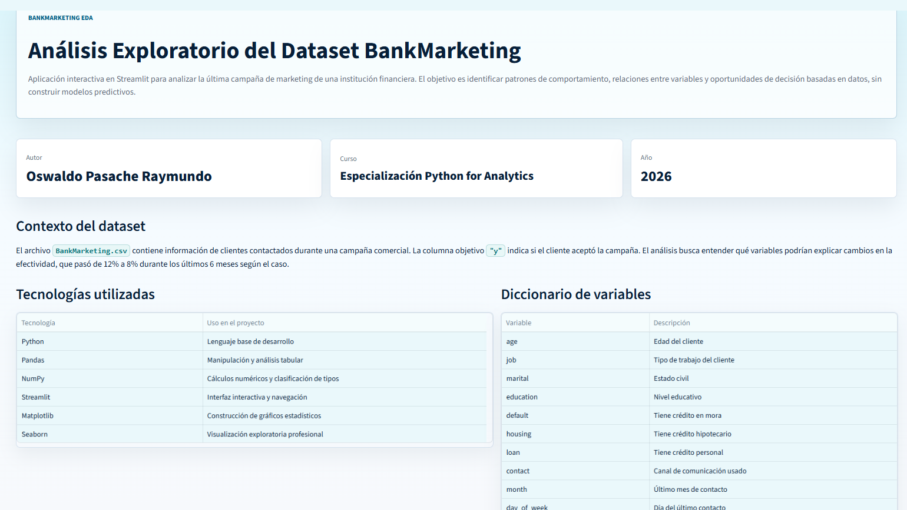
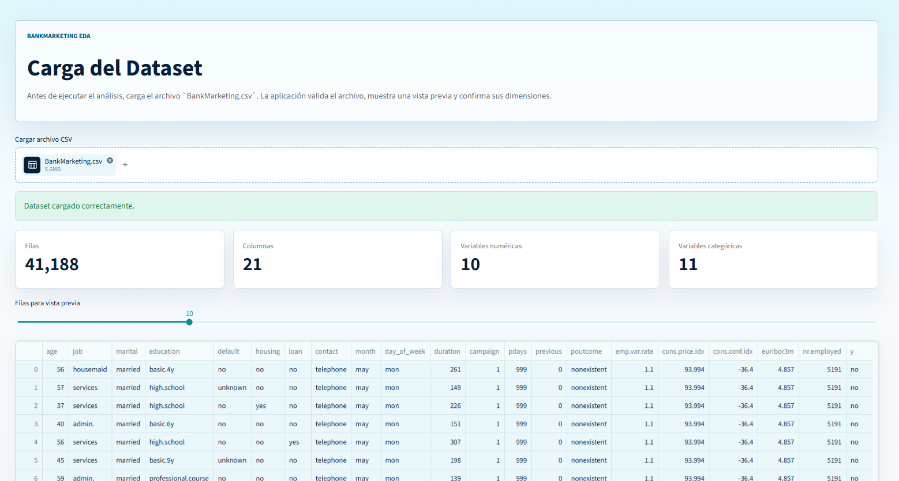
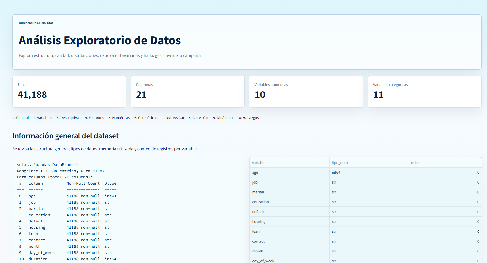
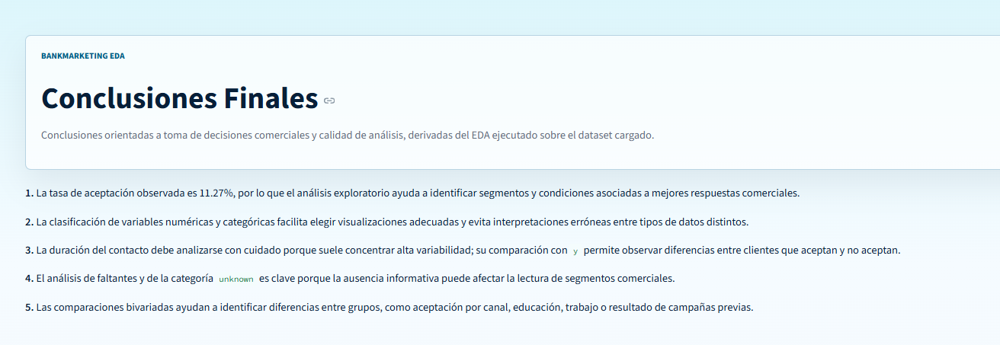

# BankMarketing EDA

Aplicación interactiva desarrollada en Python y Streamlit para realizar análisis exploratorio de datos del archivo `BankMarketing.csv`, correspondiente a una campaña de marketing de una institución financiera.

El objetivo del proyecto no es construir modelos predictivos, sino comprender patrones, relaciones y comportamientos relevantes que ayuden a explicar la aceptación o no aceptación de la campaña.

## Contenido del Proyecto

- `app.py`: aplicación principal en Streamlit.
- `requirements.txt`: dependencias necesarias para ejecutar la app.
- `BankMarketing.csv`: dataset del caso de estudio.
- `data/`: carpeta opcional para organizar una copia del dataset.
- `docs/informe_final.md`: plantilla del documento final solicitado.
- `assets/screenshots/`: carpeta para guardar capturas de la aplicación.

## Funcionalidades

- Presentación del proyecto, autor, curso y contexto del dataset.
- Carga obligatoria del archivo CSV mediante `st.file_uploader()`.
- Vista previa del dataset y validación de dimensiones.
- Análisis exploratorio organizado en 10 ítems:
  1. Información general del dataset.
  2. Clasificación de variables.
  3. Estadísticas descriptivas.
  4. Valores faltantes.
  5. Distribución de variables numéricas.
  6. Análisis de variables categóricas.
  7. Análisis bivariado numérico vs categórico.
  8. Análisis bivariado categórico vs categórico.
  9. Análisis dinámico basado en parámetros seleccionados.
  10. Hallazgos clave.
- Conclusiones finales orientadas a toma de decisiones.
- Uso de POO mediante la clase `DataAnalyzer`.
- Uso de Pandas, NumPy, Matplotlib, Seaborn y Streamlit.

## Instalación y Ejecución

1. Crear un entorno virtual:

```bash
python -m venv .venv
```

2. Activar el entorno virtual en Windows:

```bash
.venv\Scripts\activate
```

3. Instalar dependencias:

```bash
pip install -r requirements.txt
```

4. Ejecutar la aplicación:

```bash
streamlit run app.py
```

5. Abrir la URL local que Streamlit muestre en consola.

## Dataset

El archivo incluido es `BankMarketing.csv`. La aplicación solicita cargarlo desde la interfaz antes de ejecutar cualquier análisis, cumpliendo la restricción del caso: ningún análisis debe ejecutarse si el archivo no fue cargado.

Variables principales del caso:

| Variable | Descripción |
| --- | --- |
| `age` | Edad del cliente |
| `job` | Tipo de trabajo del cliente |
| `marital` | Estado civil |
| `education` | Nivel educativo |
| `default` | Tiene crédito en mora |
| `housing` | Tiene crédito hipotecario |
| `loan` | Tiene crédito personal |
| `contact` | Canal de comunicación usado |
| `month` | Último mes de contacto |
| `day_of_week` | Día del último contacto |
| `duration` | Duración del contacto en segundos |
| `campaign` | Número de contactos en la campaña actual |
| `pdays` | Días desde la última gestión |
| `previous` | Contactos previos antes de la campaña actual |
| `poutcome` | Resultado de la campaña anterior |
| `emp.var.rate` | Tasa de variación del empleo |
| `cons.price.idx` | Índice de precios al consumidor |
| `cons.conf.idx` | Índice de confianza del consumidor |
| `euribor3m` | Ratio de tipo de cambio medio a 3 meses |
| `nr.employed` | Número de empleados |
| `y` | Resultado final de aceptación |

## Capturas de la App

### Home


### Carga del Dataset


### Análisis Exploratorio


### Conclusiones


## Despliegue en Streamlit Cloud

1. Subir este repositorio a GitHub.
2. Entrar a <https://streamlit.io/cloud>.
3. Crear una nueva aplicación desde el repositorio.
4. Seleccionar `app.py` como archivo principal.
5. Publicar y copiar el link público en `docs/informe_final.md`.

## Links Relevantes

- Repositorio GitHub: https://github.com/segosval28-tech/Evaluacion2/tree/main
- Aplicación desplegada: https://evaluacion2-oswaldopasache.streamlit.app/
- Dataset: `BankMarketing.csv`.

## Autor

- Nombre: Oswaldo Pasache Raymundo.
- Curso: Especialización Python for Analytics.
- Año: 2026.
